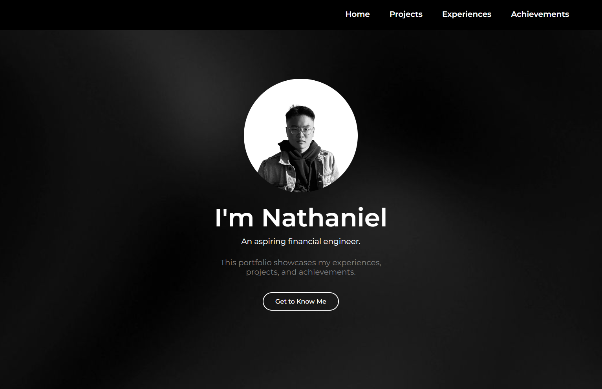

 
  <h1> Nathaniel's Portfolio Website </h1>

A clean, single-page personal portfolio built with **pure HTML and CSS**, highlighting my experience with concise role summaries and key responsibilities. It also showcases projects with brief descriptions and links, and lists achievements such as awards, certifications, or notable milestones. The contact section offers quick ways to reach me. This website is deployed on Vercel and available on [nathanieljr.vercel.app](https://nathanieljr.vercel.app).
